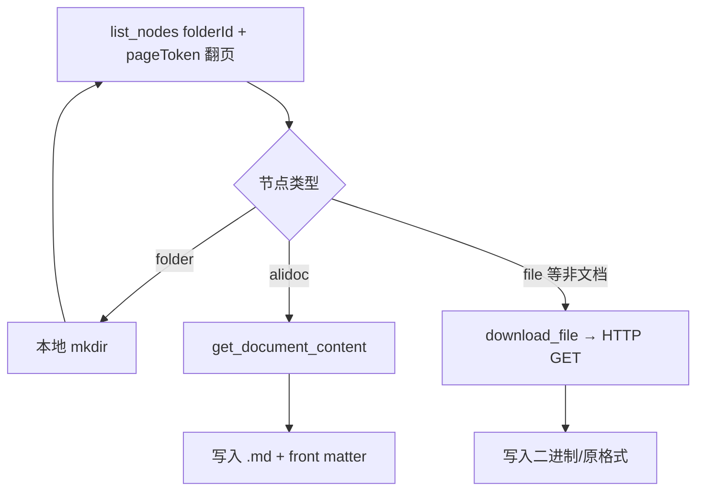

# 「前端文档」钉钉知识库 · 分批导出与落盘计划

> **知识库 ID**：`R2PmK2gngjVnZXvp`  
> **根文件夹**：前端文档 · `folderId`：`2Amq4vjg89gq1jQ5Idj5laEOV3kdP0wQ`  
> **参考目录树**：[前端文档-目录结构.md](./前端文档-目录结构.md)  
> **导出说明**：静态树中标有 `…` 的节点线下方仍有子节点，**以钉钉 `list_nodes` 实时枚举为准**，本计划按「一级目录」分批，子树一律递归，不依赖手工展开的完整树。

---

## 0. 一键脚本（自动化）

本仓库已提供 Node 脚本，通过 **Streamable HTTP** 连接钉钉官方 MCP 网关，行为等价于在 Cursor 里逐个调用 `list_nodes` / `get_document_content` / `download_file`。

| 路径 | 作用 |
|------|------|
| [scripts/export-dingtalk-docs.mjs](./scripts/export-dingtalk-docs.mjs) | 递归遍历并落盘 |
| [scripts/package.json](./scripts/package.json) | `npm run export` / `export:dry` |
| [export.config.example.json](./export.config.example.json) | 复制为 `export.config.json`（密钥仅用环境变量） |

**与人工分批的关系**：脚本一次跑满指定范围；按业务分闸时任选其一即可：

| 方式 | 说明 |
|------|------|
| 配置文件 `rootFolderId` | 导该文件夹子树（需 `workspaceId`） |
| 命令行 `-f <folderId>` | 覆盖为任意文件夹，可配合 `--root-label` 设本地第一层目录名 |
| `--kb-root` | 从知识库根列出（仅传 `workspaceId`），导出整库顶层及以下 |

详见 [README.md](./README.md) 与 `node export-dingtalk-docs.mjs --help`。

---

## 1. 目标与原则

| 项目 | 约定 |
|------|------|
| **目标** | 将「前端文档」下可访问的节点，按钉钉文件夹层级镜像到本地 Git 工作区，便于检索与版本管理。 |
| **在线文档（alidoc）** | 使用 MCP **`get_document_content`**，保存为 `.md`。 |
| **文件类节点**（PDF / docx / xlsx 等） | 使用 **`download_file`** 取 URL 与签名头后 HTTP GET，保留钉钉侧扩展名或根据 `Content-Disposition` 命名。 |
| **文件夹** | 仅在本地创建同名目录（见下文命名规则），不写文件。 |
| **幂等** | 同一轮任务内建议记录 `nodeId → 本地相对路径` 映射；重复跑时可对比「线上修改时间」或覆盖策略后重下。 |

---

## 2. 本地目录布局（镜像结构）

**根目录建议**（与现有 [README.md](./README.md) 一致，落在本仓库内）：

```text
dingtalk-document/
├── README.md
├── 前端文档-目录结构.md
├── export/                          # 批量导出根（可加入 .gitignore 若体积过大）
│   └── 前端文档/                    # 对应钉钉根文件夹展示名
│       ├── 项目手册/
│       ├── 业务文档/
│       └── ...
└── export-meta/                     # 可选：批次日志、nodeId 映射、失败重试队列
    └── manifest.jsonl
```

**文件命名（安全落盘）**

- 目录/文件名与钉钉节点名一致；若含 `\ / : * ? " < > |` 等非法字符，替换为全角同名符号或 `_`。
- 若同级重名，追加 `_<nodeId 后 6 位>` 区分。

**Markdown 文件头（建议自动追加 YAML front matter）**

- `title`、`nodeId`、`workspaceId`、`exportedAt`、`source`（钉钉链接）  
  便于审计与增量同步。

---

## 3. 架构与处理流程（执行侧）



**安全与权限**

- 仅能导出当前 MCP 登录用户在钉钉侧具备**可读/下载**权限的节点；无权限节点写入 `export-meta/skipped.jsonl` 并注明原因。
- 不在日志中打印完整签名 URL；`manifest` 仅存 `nodeId` 与相对路径。

---

## 4. 分批执行任务（主批次）

每一主批次：**从对应钉钉子文件夹起 DFS/BFS 递归 `list_nodes`**，遇文档则导出，遇文件夹则创建本地目录后继续。  
（下列批次名与 [前端文档-目录结构.md](./前端文档-目录结构.md) 一级目录对齐。）

| 批次 ID | 钉钉路径（一级） | 说明 | 建议顺序 |
|---------|------------------|------|----------|
| **B0** | — | **环境与清单**：确认 MCP 可用；`list_nodes(workspaceId=知识库)` 或 `folderId=根` 校验根子节点与 README 中树是否一致；初始化 `export/前端文档/` 与 `export-meta/`。 | 最先 |
| **B1** | `前端文档/项目手册` | 子树最大；见下文 **B1 子分批**。 | 1 |
| **B2** | `前端文档/业务文档` | 含「广告系统使用文档」子文件夹；体量中等。 | 2 |
| **B3** | `前端文档/开发设计技术方案讨论` | 多为浅层文档，适合快速收尾。 | 3 |
| **B4** | `前端文档/需求评估设计相关` | 同 B3。 | 4 |
| **B5** | `前端文档/会议记录` | 节点少。 | 5 |
| **B6** | `前端文档/sagasCacheWarp` | 单文档或极少节点。 | 6 |
| **B7** | `前端文档/存档_废弃文件夹` | 含「工作内容整理」大量历史子文件夹；可再拆 **B7a/B7b**（见下）。 | 7 |

**B7 建议再拆（可选）**

- **B7a**：`存档_废弃文件夹` 下除 `工作内容整理` 以外的根层文档与文件夹。  
- **B7b**：`存档_废弃文件夹/工作内容整理` 整块（按日期/主题子文件夹递归，适合单独一晚跑批）。

---

## 5. B1「项目手册」子分批（降低单次上下文与失败半径）

| 子批 | 钉钉相对路径 | 备注 |
|------|----------------|------|
| B1-1 | `项目手册` 根下直连文档（如《项目手册》《新人文档链接索引》） | 先小范围验证 Markdown→落盘链路 |
| B1-2 | `项目手册/技术方案说明` | 专题文件夹多，标 `…` 处必须递归到底 |
| B1-3 | `项目手册/开发资源工具` | |
| B1-4 | `项目手册/UI&交互` | |
| B1-5 | `项目手册/多平台文档` | |
| B1-6 | `项目手册/开发规则文档` | |
| B1-7 | `项目手册/开发项目说明` | |
| B1-8 | `项目手册/单据业务说明` | |

每完成一个子批：在 `export-meta/batch-log.md` 勾选，并记录失败 `nodeId` 列表供重试。

---

## 6. 单批标准操作步骤（SOP）

1. **定位 folderId**  
   - 根：`2Amq4vjg89gq1jQ5Idj5laEOV3kdP0wQ`  
   - 子文件夹：若未知 ID，从父级 `list_nodes` 结果中根据 `name` 匹配得到 `nodeId`，再作为下一层 `folderId`。
2. **遍历**  
   - `pageSize=50`，循环 `pageToken` 直至无下一页。  
   - `hasChildren=true` 的文件夹入队继续。
3. **导出**  
   - `alidoc` → `get_document_content` → `export/.../<标题>.md`  
   - 文件节点 → `download_file` → GET → 原扩展名保存。
4. **记录**  
   - 追加一行 `manifest.jsonl`：`{batch, nodeId, type, relPath, ok, error?}`。
5. **验收**  
   - 文件夹数量与钉钉该子树层级大致一致；随机抽 3 篇 Markdown 打开检查编码与图片（若有外链图需备注是否需人工另存）。

---

## 7. 工作量与风险（心里有数）

| 风险 | 应对 |
|------|------|
| API/凭证限流 | 批次间 sleep 1～2s；单批失败自动重试 3 次。 |
| 大附件占仓库体积 | 大文件单独子目录 + LFS 或 `.gitignore` + 仅保留清单。 |
| 文档内含图片/附件块 | Markdown 可能为外链；若需离线完整包，需另做附件拉取（超出当前 MCP 描述范围则记技术债）。 |
| 树与文档不一致 | 以钉钉为准；定期用 `list_nodes` 重扫增量。 |

---

## 8. 执行检查清单（整体验收）

- [ ] B0 根目录枚举与 [前端文档-目录结构.md](./前端文档-目录结构.md) 一级子命名一致（允许增删）。  
- [ ] B1～B7 且 B1-1～B1-8 全部勾选完成或遗留项记入 `skipped.jsonl`。  
- [ ] `export/前端文档/` 下目录层级与钉钉「文件夹」层级对齐。  
- [ ] `README.md` 增补一节：导出时间、批次策略、如何更新。  

---

*本文档为执行说明；实际 `nodeId` 以 MCP `list_nodes` 返回为准。*
